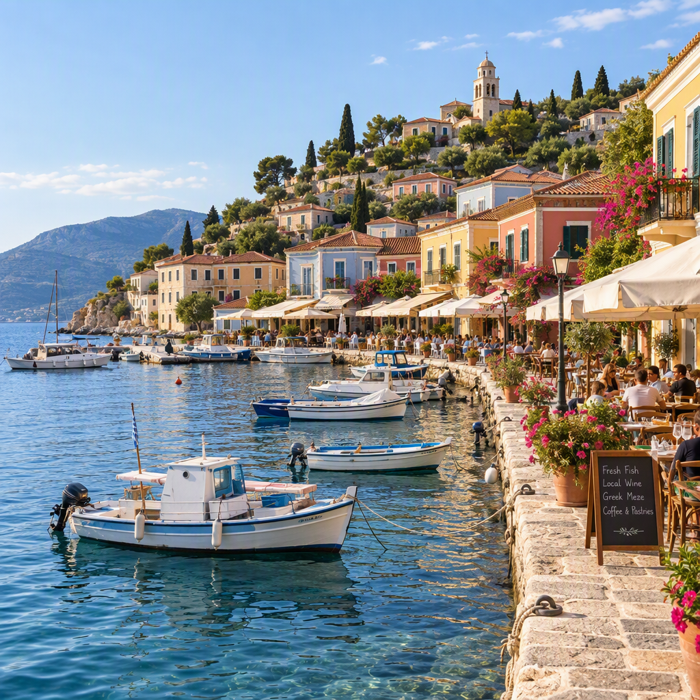
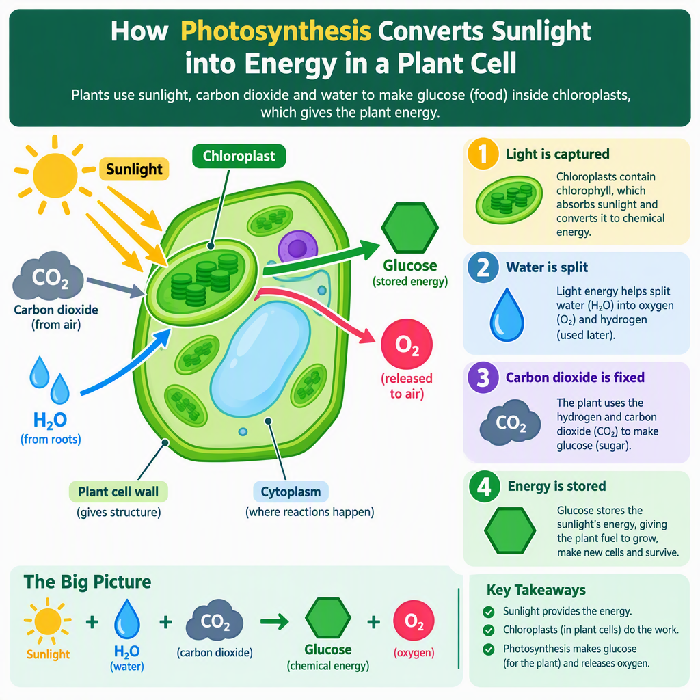
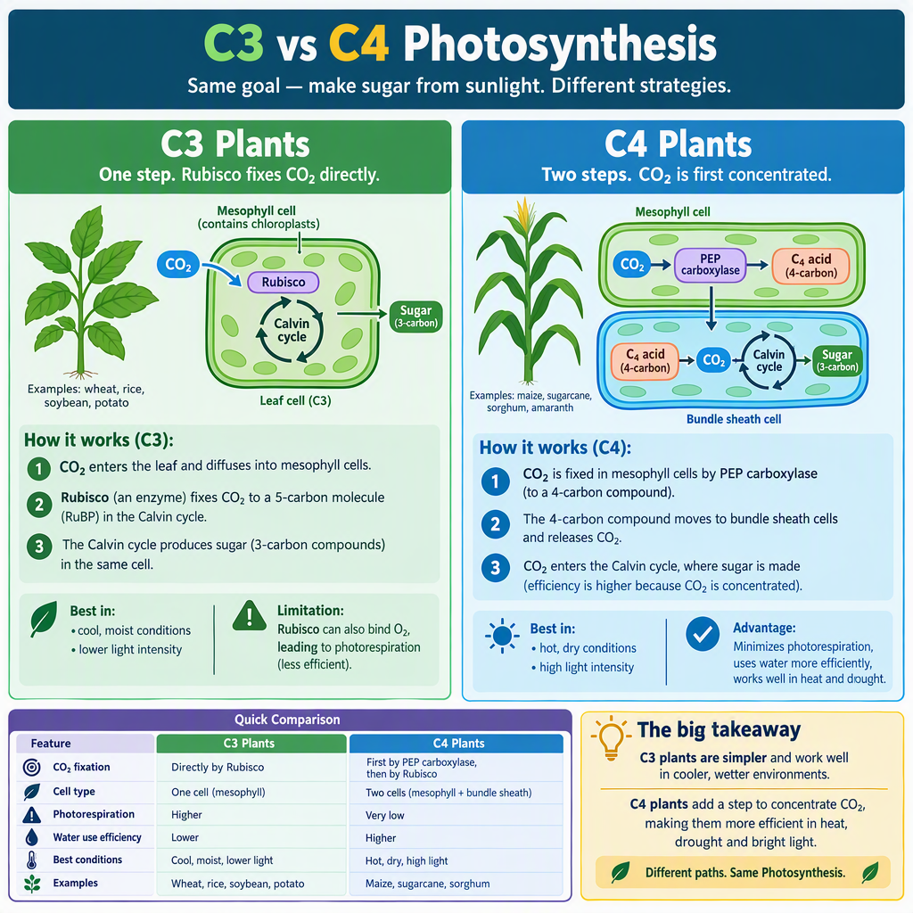
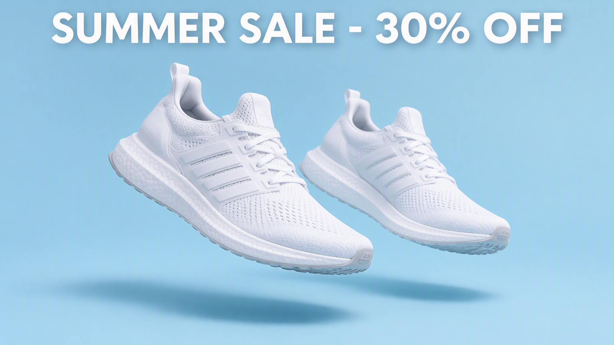
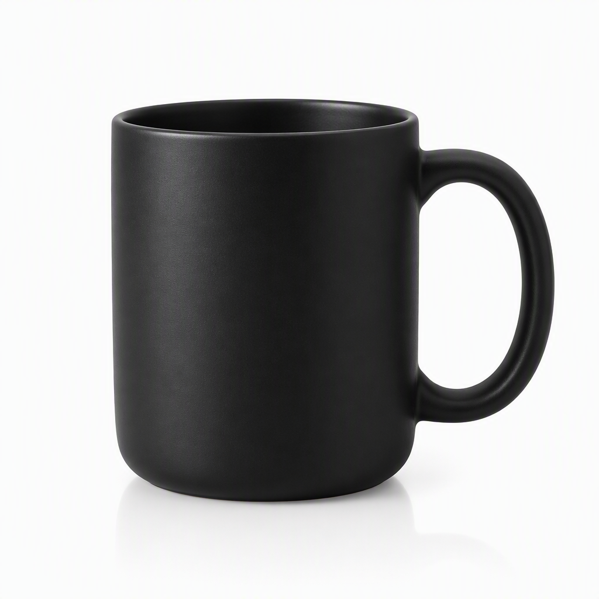
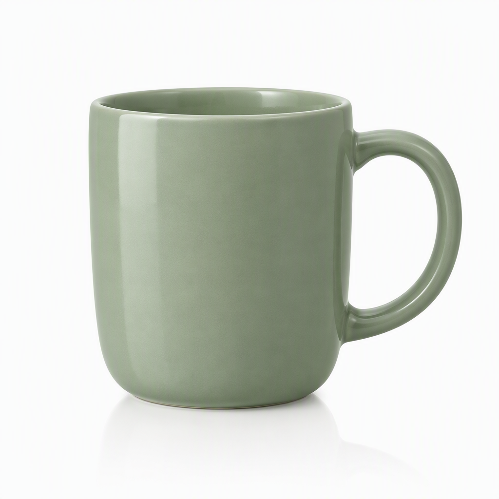
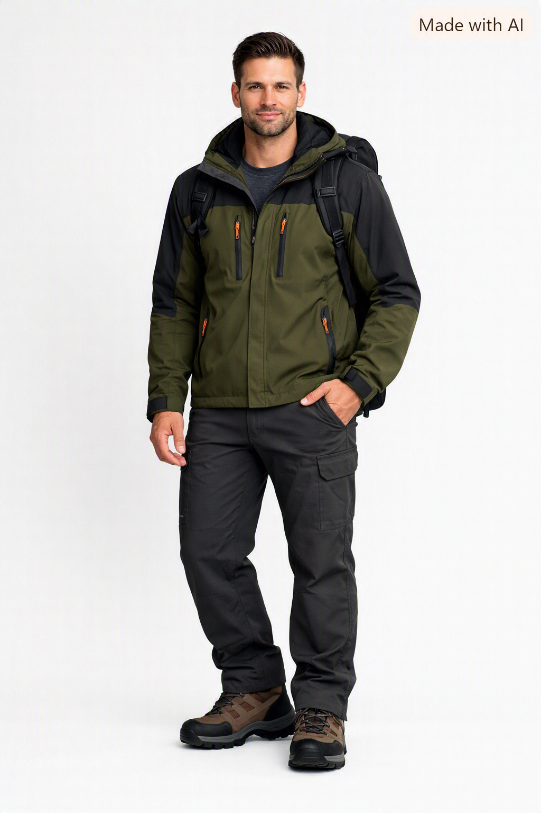
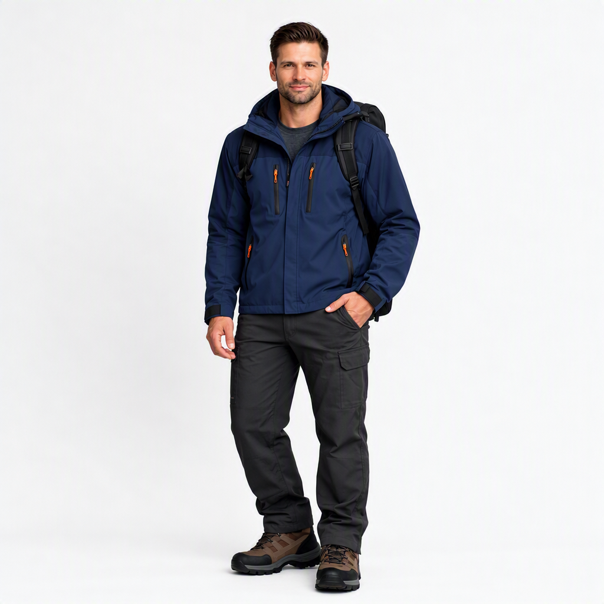

# GPT 2.5 Image Flare and Sunburst Demo

A .NET 10 console app demonstrating Azure OpenAI image generation and image editing with two configured deployments: **Flare** for previews and batch work, and **Sunburst** for final-quality assets and product-photo edits.

> **Security:** Never commit API keys or paste real credentials into this README. Supply your own Azure OpenAI resource endpoint and API key through .NET User Secrets or environment variables.

## Requirements

- .NET 10 SDK
- An Azure OpenAI resource with image models deployed
- Deployments whose names match the configured names below, or update the constants in `Program.cs`
- A valid PNG/JPG source photo named `customer-tryon-photo.png` in the app's working directory to run Case 5

## Packages

The project targets `net10.0` and references these NuGet packages (versions from the project file):

| Package | Version | Purpose |
|---|---:|---|
| `Azure.AI.OpenAI` | `2.1.0` | Azure OpenAI client used by image generation requests |
| `Azure.Identity` | `1.21.0` | Azure identity library referenced by the project; current sample authenticates with an API key instead |
| `Microsoft.Extensions.Configuration.EnvironmentVariables` | `10.0.12` | Read settings from environment variables |
| `Microsoft.Extensions.Configuration.UserSecrets` | `10.0.12` | Keep local development secrets outside source control |

No separate image-processing package is used. Image-edit calls use .NET's built-in `HttpClient` and multipart form support.

## Azure setup and credentials

1. Create or select an Azure OpenAI resource that supports the image models and operations used by this sample.
2. Deploy the models in Azure AI Foundry/Azure OpenAI. The app currently expects deployment names `gpt-image-2.5-flare` and `gpt-image-2.5-sunburst`. A deployment name is the name assigned to that deployment in Azure; change the constants in `Program.cs` if yours differ.
3. In the Azure portal or Foundry, copy the resource **Endpoint** and an API key from the resource's **Keys and Endpoint** page. Use the key belonging to the same resource as the endpoint.
4. Set local secrets from the project directory (replace the placeholders with your own values):

```bash
dotnet user-secrets set "AZURE_AI_ENDPOINT" "https://<your-resource-name>.openai.azure.com/"
dotnet user-secrets set "AZURE_AI_API_KEY" "<your-resource-api-key>"
```

The code reads User Secrets first, then environment variables. For a deployment environment, define `AZURE_AI_ENDPOINT` and `AZURE_AI_API_KEY` as protected environment variables or secret-store entries instead of User Secrets.

Image edits use `AZURE_AI_IMAGE_EDIT_API_VERSION`; if unset, the current default in `Program.cs` is `2025-04-01-preview`:

```bash
dotnet user-secrets set "AZURE_AI_IMAGE_EDIT_API_VERSION" "2025-04-01-preview"
```

The code sends the key in the `api-key` HTTP header for direct multipart edit requests. Generation requests use `AzureOpenAIClient` with `ApiKeyCredential`.

### Important endpoint/model compatibility note

Generation and editing are different API operations. A deployment working for generation does not by itself prove that the deployment/resource supports the edit route. If an edit returns HTTP 404, confirm the exact deployment name and verify that the deployed model and API version support image edits for the resource. The sample surfaces the HTTP status, URL, and response body to help diagnose service-side errors. Do not put the API key in logs or error reports.

## Build and run

From the project directory:

```bash
dotnet restore
dotnet build
dotnet run
```

The program runs all five cases sequentially. Generated PNGs are written to the current working directory, which is normally the project directory when started there. Case 5 expects `customer-tryon-photo.png` there; this is an input file, not generated by the app.

## The five demo cases

### Case 1 — Home design: iterative image edit

- Generates a modern kitchen image with Flare at `1536x864`.
- Saves `kitchen-v1.png`.
- Sends that image and an edit prompt through the HTTP multipart image-edit request, asking for brighter lighting and natural wood accents while preserving composition.
- Saves `kitchen-v2.png`.

**Generated images**

| Original | Edited |
|---|---|
|  |  |

### Case 2 — Travel planning: previews and final asset

- Generates two square (`1024x1024`) coastal-town concept previews with Flare.
- Saves `preview-0.png` and `preview-1.png`.
- Generates a wide (`1536x864`) itinerary hero image with Sunburst.
- Saves `itinerary-day3-final.png`.

**Generated images**

| Preview 1 | Preview 2 |
|---|---|
|  |  |

**Final itinerary image**


### Case 3 — Education: evolving lesson diagrams

- Generates a square diagram for each of two successive photosynthesis lesson concepts using Flare.
- Saves `lesson-diagram-0.png` and `lesson-diagram-1.png`.

**Generated diagrams**

| Photosynthesis overview | C3 and C4 comparison |
|---|---|
|  |  |

### Case 4 — Retail campaign and catalog images

- Creates a wide (`1536x864`) summer-sale banner with Sunburst and saves `campaign-summer-sale-banner.png`.
- Generates studio product photos for three ceramic mugs with Flare at `1024x1024`.
- Saves `catalog-SKU-1001.png`, `catalog-SKU-1002.png`, and `catalog-SKU-1003.png`.

**Campaign banner**



**Catalog images**

| SKU-1001 — matte black | SKU-1002 — glossy red | SKU-1003 — sage green |
|---|---|---|
|  |  |  |

### Case 5 — Virtual try-on: successive photo edits

- Reads `customer-tryon-photo.png` from the current working directory.
- Uses the HTTP multipart edit route with Sunburst to recolor the jacket, then edit the background while retaining the prior result.
- Saves `tryon-navy.png` and `tryon-navy-outdoors.png`.

**Input and generated images**

| Source photo | Navy jacket | Navy jacket, outdoor setting |
|---|---|---|
|  |  |  |

## Configuration reference

| Setting | Required | Default / use |
|---|---|---|
| `AZURE_AI_ENDPOINT` | Yes | Azure OpenAI resource endpoint, e.g. `https://<resource>.openai.azure.com/` |
| `AZURE_AI_API_KEY` | Yes | API key for that resource; keep it secret |
| `AZURE_AI_IMAGE_EDIT_API_VERSION` | No | `2025-04-01-preview` in the current code; use an API version supported by your resource and image-edit deployment |

Deployment names are currently constants in `Program.cs`: `gpt-image-2.5-flare` and `gpt-image-2.5-sunburst`.

## Notes

- Image generation uses the Azure OpenAI .NET SDK; the two image-edit helpers use direct HTTP multipart requests and share the HTTP response parser.
- Image edit inputs must be supported PNG/JPG files and meet the service's documented size limits.
- Image generation and edit availability, supported sizes, API versions, latency, and pricing depend on the model deployment and Azure resource configuration. Check the current Azure documentation and your deployment settings.
- The repository may contain generated PNG outputs after running the sample. Avoid committing customer photos or other private images.
